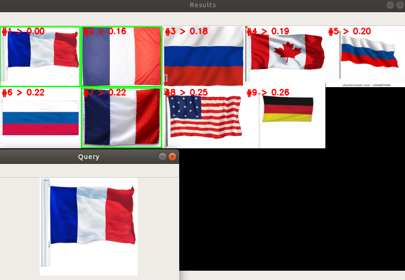

# jina_image_search_engine
Building a basic image search engine with Jina

## Example 1


## Instructions

### Clone the project

```
git clone https://github.com/k-zehnder/jina_image_search_engine
```

### Setup

Edit `app.py` to set query image and result limit.

```shell
cd jina_image_search_engine
python -m venv venv # optional
source venv/bin/activate # optional
pip install -r requirements.txt
python app.py
```

## What is this?
