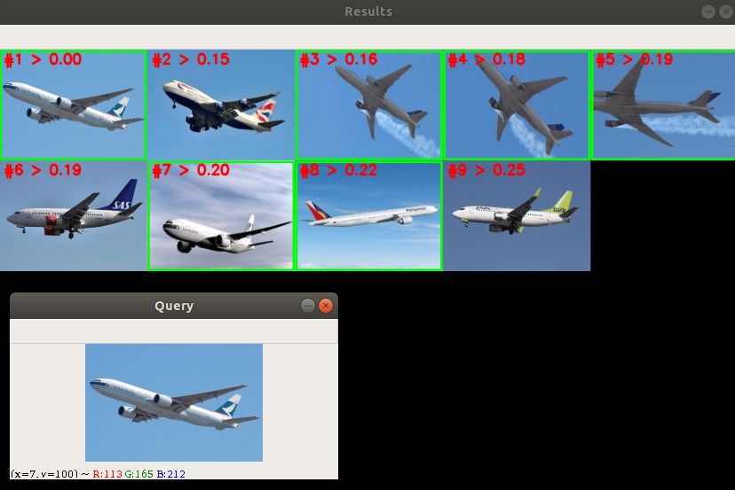
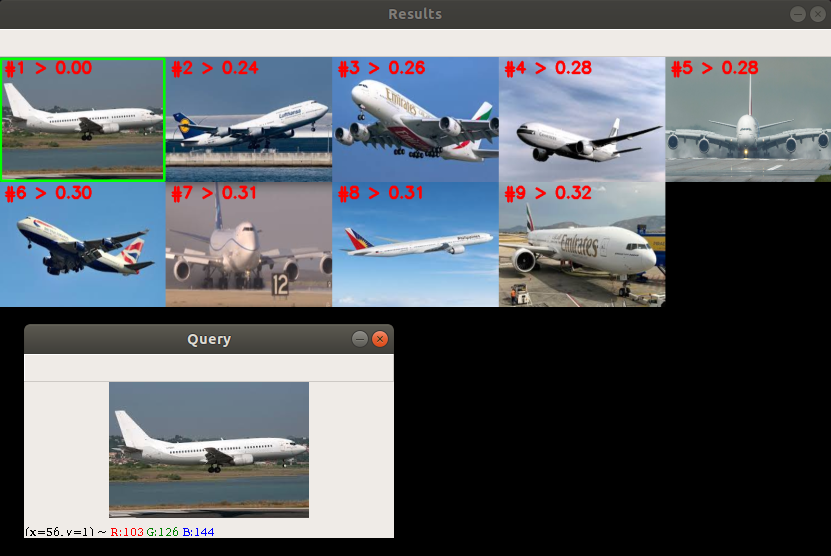

# jina_image_search_engine
Building a basic image search engine with Jina

## Example 1


## Example 2


## Example 3


## Instructions

### Clone the project

```
git clone https://github.com/k-zehnder/jina_image_search_engine
```

### Setup

Edit `app.py` to set query image and result limit.

```shell
cd jina_image_search_engine
python -m venv venv # optional
source venv/bin/activate # optional
pip install -r requirements.txt
python app.py
```

## What is this?
Jina makes it easy and fun to build state of the art image search engines. This simple project uses the power of Jina to build a dataset of images that is *visually searchable*. This means as opposed to text-based searching like we are familiar with on google/bing/duckduckgo, we can leverage Jina to literally search for images with another image, absent of any textual hints. Jina is as awesome as it sounds, and it enables advanced intelligence on everything from PDFs to mp3's.

## How does it work?
The Jina framework is extremely easy-to-use and intuitive. `Flow` objects are responsible for chaining together a collection of `Executors`, which are essentially python classes that perform lighting fast operations on a list-like data-structure in the Jina AI ecosystem called a `DocArray`.

Inside the `Flow`, we then extract features from each image describing their contents quantitatively. This is facilitated by a cool property of DocumentArray's which allows them to embed pre-trained neural networks. We capitalize on this ability for DocumentArray's to quantify the contents of an image so that we can build a searchable database of "described" images, typically referred to as the indexing process. 

Now that we have our feature vectors extracted and stored, our final step will be to extract features from a query image to *visually search* them against our database of features. This will take our query image, described as a list of numbers, and compare it to each image in our indexed dataset, outputting a "distance" metric (cosine similarity) which represents how "similar" the query image feature vector is to each image in our indexed dataset. The ability to abstractly represent an image as a list of numbers, and then compare these numbers for similarity, is the real "magic" behind how this all works.
